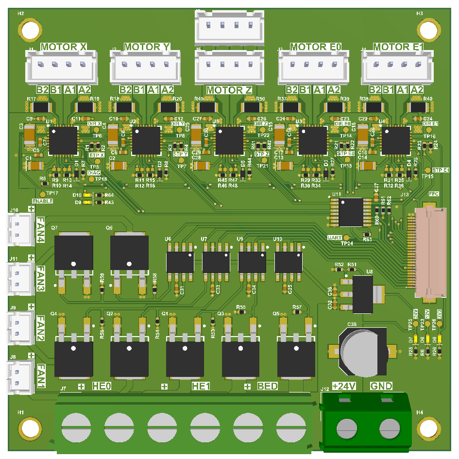

# 3D Printer Motion and Thermal Control Board

This board is designed to drive stepper motors, heating elements, and fans of a 3D printer. The control signals are received from a dedicated MCU board via an FFC cable. It is built to be compatible with a custom 3D printer, which can be found [here](https://github.com/Fake-Oxygen/3D-PRINTER).

## Features

- **Input Voltage Range**: 12-36V
- **Stepper Motor Drivers**: 5x TMC2208
- **Multiplexed UART**: For each TMC2208 driver
- **Heating Elements**: Support for up to 3
- **Fans**: Support for up to 4

## Block Diagram

## Pinout

| Designator | Connector              | Function                        |
|-------------|------------------------|---------------------------------|
| J1          | JST-B4B-XH-A(LF)(SN)    | Stepper motor X axis           |
| J2          | JST-B4B-XH-A(LF)(SN)    | Stepper motor Y axis           |
| J3          | JST-B4B-XH-A(LF)(SN)    | Stepper motor E0 axis          |
| J4          | JST-B4B-XH-A(LF)(SN)    | Stepper motor E1 axis          |
| J5, J6      | JST-B4B-XH-A(LF)(SN)    | Stepper motor Z axis           |
| J7          | TB004-750-06GR          | Heating elements (HE0, HE1, BED) |
| J8, J9, J10, J11 | JST-B2B-PH-K-S(LF)(SN) | Fans                         |
| J12         | TB004-750-02GR          | Power input                    |
| J13         | FH12-26S-0.5SH(55)      | Control signals I/O            |

## FFC Pinout

| Pin | Name                         | Type         |
|-----|------------------------------|--------------|
| 1   | BED Mosfet PWM input          | Input, PWM   |
| 2   | Header 1 Mosfet PWM input     | Input, PWM   |
| 3   | Header 0 Mosfet PWM input     | Input, PWM   |
| 4   | Fan 1 Mosfet PWM input        | Input, PWM   |
| 5   | Fan 2 Mosfet PWM input        | Input, PWM   |
| 6   | Fan 3 Mosfet PWM input        | Input, PWM   |
| 7   | Fan 4 Mosfet PWM input        | Input, PWM   |
| 8   | GND                           | Power        |
| 9   | TMC2208 Common UART signal    | I/O, UART    |
| 10  | UART Multiplexer S1           | Input        |
| 11  | UART Multiplexer S2           | Input        |
| 12  | UART Multiplexer S3           | Input        |
| 13  | Stepper motor X Axis Step signal | Input     |
| 14  | Stepper motor X Axis Dir signal  | Input      |
| 15  | Stepper motor Y Axis Step signal | Input     |
| 16  | Stepper motor Y Axis Dir signal  | Input      |
| 17  | Stepper motor Z Axis Step signal | Input     |
| 18  | Stepper motor Z Axis Dir signal  | Input      |
| 19  | Stepper motor E0 Axis Step signal | Input    |
| 20  | Stepper motor E0 Axis Dir signal  | Input     |
| 21  | Stepper motor E1 Axis Step signal | Input    |
| 22  | Stepper motor E1 Axis Dir signal  | Input     |
| 23  | Stepper motors Enable signal   | Input       |
| 24  | Stepper motors Diag signal     | Output      |
| 25  | +3.3V power input             | Power        |
| 26  | GND                           | Power        |

